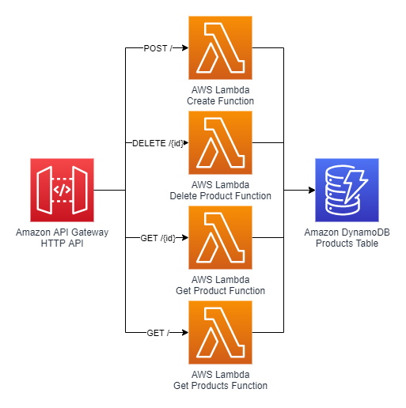

Serverless REST API using Rust
==============================

<p align="center">
  
</p>

A sample serverless REST API service made in Rust with a DynamoDB backend.

Inspired from [Paul Maddox](https://twitter.com/paulmaddox)'s [rust-rest-dynamodb](https://github.com/PaulMaddox/rust-rest-dynamodb), that uses the [Rocket framework](https://rocket.rs/) for the REST API.

## Running this example

To deploy this, you will need the Rust toolchain, by following the instructions at [https://rustup.rs/](https://rustup.rs/). You will also need the [cfn-lint](https://github.com/aws-cloudformation/cfn-python-lint) tool for linting the CloudFormation template and the [AWS SAM CLI](https://docs.aws.amazon.com/serverless-application-model/latest/developerguide/serverless-sam-cli-install.html) for deploying the infrastructure on AWS.

You will also need an AWS account where the resources will be deployed.

```
# Linting/checking files
# This requires 
make lint

# Build binaries, Lambda functions, etc.
make build

# Deploy to AWS
make deploy
```
